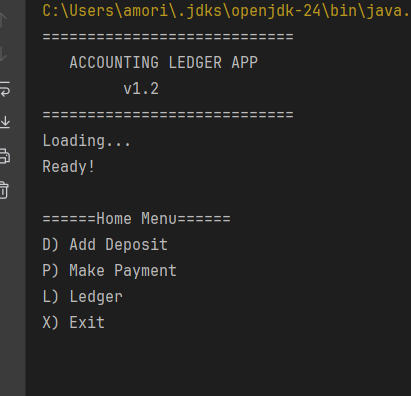

# Accounting Ledger

## Description
This is my first capstone from learn to code academy. It is a Command-Line-Interface(CLI) project that 
tracks transactions for the user. In this application the user can add deposits, record payments, and generate a ledger report filtered
by type, vendor, date range, or price range. All transactions are saved into a CSV file.

Demonstrates usage of Java development skills like file handling, user input usage, and CLI navigation.

## Demo
[](https://www.youtube.com/watch?v=YKZ-yAbuyzk)


## Features
- Add new deposits
- Record payments (debits)
- View full ledger (newest first)
- Filter by Deposits or Payments
- Generate Reports:
  - Month-to-date
  - Previous month
  - Year-to-date
  - Previous year
  - Search transactions by Vendor
- (Optional) Custom search across multiple fields

## Installation
1. Clone this repository:
   ```bash
   git clone https://github.com/AbrahamGhani/Capstones.git
    ```
2. Navigate into project directory:
   ```bash
   cd Capstone1-AccountingLedger
    ```
3. Run with Maven
   ```bash
   mvn compile exec:java -Dexec.mainClass="com.pluralsight.Main"
    ```


- Notes:
    - You can run this project in an IDE
    - Ensure you have java installed on your computer

## Usage
Launch the application through the Command Line Interface (CLI) or an IDE.

Use the menu options to:
- Add deposits
- Record payments
- View ledger (all entries, deposits only, payments only)
- Generate different types of reports

All transactions are saved in the transactions.csv file located in the same project directory.

## Screenshots
| Feature          | Preview      |
|------------------|--------------|
| Main Menu        |  
| Ledger Entry     |  
| Reports View     |  

## Technologies Used
- Java 17
- Java File I/O (BufferedReader, BufferedWriter)
- Java Time 
- Maven
- Intellij
- Git and GitHub
- CLI

